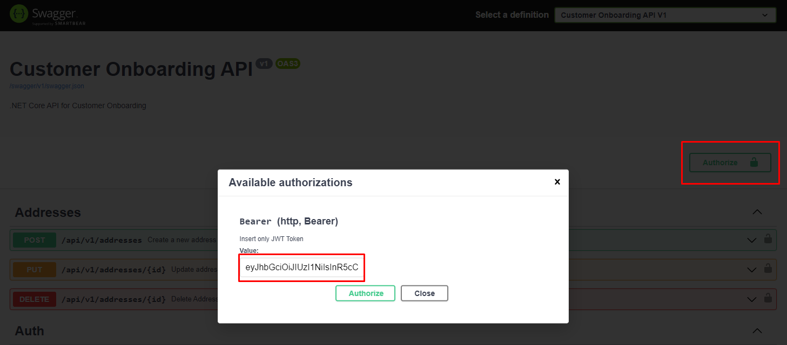

# Sobre o projeto
Esse projeto foi desenvolvido com o intuito de apoiar uma empresa em expansão e que precisa criar uma funcionalidade robusta, escalável, segura e performática para cadastro de clientes.

O principal objetivo é combinar várias tecnologias para criar essa solução, de forma que seja simples de executar, dar manutenção e que atenda a todos os critérios solicitados pela empresa.

> ## Keywords
> Database: Redis (cache), SQLServer, Stored Procedures, Query Optimization, Index, PK, FK;
> 
> Back-End: .NET Core 6.0, Entity Framework Core, Migrations, Database Seeds, Authorization, Authentication, MediatR, Encryption;
> 
> Patterns: Clean Architecture, Dependency Injection, Repository, CQRS, Domain Driven Design, REST API, Swagger;
> 
> Front-End: Nginx, JavaScript, HTML, CSS, Fetch Request;
>
> DevOps: Docker, DockerCompose, GIT, GitHub;

# Executando o projeto

Pré-requisitos
- [Docker](https://www.docker.com/)

Após clonar o repositório, abra o terminal na raiz do projeto (onde está localizado o arquivo docker-compose.yml) e execute o comando:

```docker-compose up```

Pronto! Você já pode começar a cadastrar usuários e seus endereços acessando http://localhost:80.

### Entendendo o docker-compose
Ao executar esse comando, todas as tecnologias necessárias para o projeto são provisionadas de forma automática, sendo elas .NET, Redis, Nginx, SQLServer, MSSQL Tools. Todas elas serão automaticamente configuradas, sincronizadas entre si e acessíveis via localhost nas portas:

- [.NET](http://localhost:8080) - http://localhost:8080
- [SQL Server](http://localhost:1433) - http://localhost:1433
- [Redis](http://localhost:6379) - http://localhost:6379
- [Nginx](http://localhost:80) - http://localhost:80

Essa é a relação entre as tecnologias:


# Performance & Segurança

O principal requisito para o sistema é a performance já que é esperado um grande volume de requisições. Pensando nisso, a solução foi desenvolvida utilizando containerização de todas as principais tecnologias, o que permite o Scalling sob demanda (principalmente em momentos de picos) para atender a todos os usuários.

O Redis foi utilizado para aliviar a demanda ao SQLServer garantindo performance extra em requisições do tipo [GET] e permitir cache compartilhado.

O Backend é totalmente stateless, o que permite que a aplicação escale sob demanda e faça bom uso do cache compartilhado entre as instâncias.

O request para a lista de usuários ([GET] api/v1/users) é paginado pois, caso não fosse, retornaria 100% dos registros do banco. A paginação limita a quantidade de registros retornados por request o que otimiza tanto o request time, network traffic e recursos do SQLServer.

As imagens são salvas como byte array (byte[]) no banco de dados, o que garante uma economia de espaço no banco de dados de [aproximadamente 33%](https://lemire.me/blog/2019/01/30/what-is-the-space-overhead-of-base64-encoding/) em relação a mesma imagem codificada em Base64 e, consequentemente, reduz a quantidade de dados trafegados na rede.

Pensando em segurança, todas as rotas requerem Autenticação e validam as roles (sys_user e sys_admin) presentes no Token JWT. As senhas dos usuários nunca são salvas no banco de dados, ao invés disso é utilizada uma estratégia de adicionar um salt na senha, gerar um hash e salvar o hash no banco de dados. Por fim, Stored Procedures e o EF Core garantem que usuários mal intencionados não se aproveitem de SQL Injection.


# Back-end
O backend foi desenvolvido em .NET Core 6.0. É uma API REST que requer autenticação em todas as suas rotas (exceto [POST] api/v1/auth e [POST] api/v1/users). Para visualizar todas as rotas disponíveis basta acessar http://localhost:8080/swagger/index.html.

No startup da aplicação .NET, o Entity Framework (EF) aplicará as migrations e irá popular o banco de dados com 10 usuários, nos quais 5 deles são Admins e outros 5 são usuários comuns, cada um com 1 endereço e a mesma logo (é possível cadastrar novos usuários pelo frontend ou por chamadas http - swagger, postman, etc...).

- A configuração das tabelas Users e Address estão no diretório Infrastructure/Databases/SqlServer/Configurations;
- As seeds estão no diretório WebApi/Extensions/SqlSeverExtensions.cs e só são aplicadas em ambiente de desenvolvimento.

As credenciais dos usuários são:

| Email  | Password | Role |
| ------------- | ------------- | ------------- |
| admin1@gmail.com  | Str0ngAnds3f3pa55!  | sys_admin  |
| admin2@gmail.com  | Secur3Pa$$word2!  | sys_admin  |
| admin3@gmail.com  | My$trongP@ssw0rd!  | sys_admin  |
| admin4@gmail.com  | Adm1nS3cur3P@ss!  | sys_admin  |
| admin5@gmail.com  | Sup3rSecr3tP@ss!  | sys_admin  |
| user6@gmail.com  | Us3rP@ssw0rd6!  | sys_user  |
| user7@gmail.com  | 7S3cureP@ssword!  | sys_user  |
| user8@gmail.com  | User8Str0ngP@ss!  | sys_user  |
| user9@gmail.com  | 9SecureP@ssword!  | sys_user  |
| user10@gmail.com  | Us3rTenS3cure!  | sys_user  |

Usuários com roles sys_admin estão autorizados a ver os dados de todos os usuários do sistema e modificá-los.
Usuários com roles sys_user estão autorizados a ver apenas seus próprios dados e modificá-los.

Você pode interagir com a API via Swagger, basta se autenticar na rota [POST] api/v1/auth com qualquer uma das credenciais listadas acima e copiar o jwtToken.


Com o Token JWT em mãos, vá até a parte superior do swagger, clique em "Authorize" no canto superior direito, informe apenas o token (NÃO coloque 'Bearer' antes do token) e clique em Authorize.



Após autenticar, é possível ver que os ícones de cadeado ao lado de cada rota será igual a esse


A aplicação adere à Clean Architecture, separando-a em camadas e delegando suas respectivas responsabilidades. Além disso, para facilitar a separação entre operações de escrita e leitura, o padrão CQRS foi utilizado junto com MediatR. Por fim, o padrão repository foi utilizado para controlar o acesso externo da aplicação ao Redis e SQLServer.


# Bancos de dados

A aplicação conta com dois bancos de dados, SQLServer e Redis, cada um com sua função específica.

## SQLServer 2019

O SQLServer foi utilizado pois é um requisito para a empresa, além disso ele suporta várias tecnologias que facilitam o desenvolvimento e segurança, como suporte a Migrations e Stored Procedures.

O docker-compose utiliza a imagem 2019-latest e também configura as credenciais de acesso. O mssql-tools é utilizado para criar automaticamente as Stored Procedures (disponíveis no diretorio scripts/create_procedures.sql). 

Após ser provisionado pelo docker-compose, as tabelas (Users e Address) e Stored Procedures podem ser visualizados no Azure Data Studio (ou outra ferramenta de sua preferência). As credênciais de acesso estão disponíveis no docker-compose.yml (lembre-se de substituir Server=database,1433 por Server=localhost,1433).


## Redis

Um critério para a empresa é a performance da aplicação, pensando nisso o Redis foi utilizado para armazenar resultados de queries e aliviar operações repetitivas no banco de dados.

A versão utilizada pelo docker-compose é redis:alpine.

# Front-end

Devido a limitações de tempo para desenvolvimento, não foi possível desenvolver o front utilizando .NET e Razor Pages, entretanto, a alternativa adotada foi utilizar HTML, CSS e JS puros e servir esses arquivos estáticos com Nginx, essa é uma boa alternativa já que está alinhada ao requisito principal de performance solicitado pela empresa. 

Os arquivos do frontend estão dentro do diretório WebApp e a versão utilizada pelo docker-compose para o Nginx é nginx:alpine.

O front já está configurado para utilizar todas as rotas do back e está disponível em http://localhost:80.


Ao logar com um usuário cuja role é sys_admin, você será redirecionado para a pagina com uma lista de todos os usuários e poderá selecionar qual deles você quer editar.


Ao logar com um usuário cuja role é sys_user ou selecionar um usuário na lista de usuários, você será redirecionado para a página de detalhes, onde é possível editar os dados do usuário e cadastrar, remover ou editar seus endereços.


# Autocrítica

Devido à limitação de tempo, alguns detalhes não puderam ser implementados como eu gostaria, mas vale a pena registrar que os pontos a seguir já estão priorizados para implementações futuras.
- Razor pages;
- Certificado autogerenciado para executar a aplicação em rotas HTTPS;
- Ao habilitar rotas HTTP, seria possível salvar o Token JWT de forma segura nos cookies, aumentando ainda mais a segurança;
- Validação de inputs: Com tantas features para desenvolver em pouco tempo, os inputs do usuário não foram validados, entretanto, por se tratar de uma POC, a aplicação atende aos requisitos.
